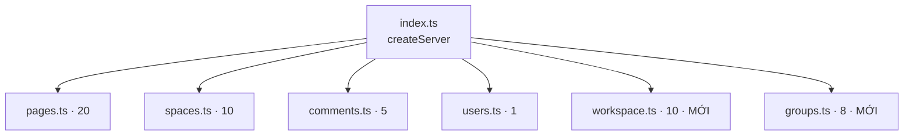

# Thiết kế: Bổ sung tool quản lý Workspace member & Group

- **Ngày**: 2026-07-03
- **Phiên bản đích**: 1.2.0 → 1.3.0
- **Trạng thái**: Đã duyệt scope, chờ review spec

## 1. Mục tiêu

Bổ sung **18 tool MCP** để AI agent quản lý được **thành viên workspace**, **lời mời (invitation)**, và **nhóm (group)** trong Docmost — những vùng hiện chưa có tool nào ngoài `docmost_get_current_user`.

Sau thay đổi: **36 tool → 54 tool**.

## 2. Phạm vi

### Trong phạm vi (18 tool mới)

| Nhóm | Số tool | File |
|------|---------|------|
| A — Workspace members | 5 | `src/tools/workspace.ts` (mới) |
| B — Workspace invitations | 5 | `src/tools/workspace.ts` (mới) |
| D — Groups | 8 | `src/tools/groups.ts` (mới) |

### Ngoài phạm vi (quyết định của người dùng)

- **Workspace settings** (`/workspace/info`, `/workspace/update`): BỎ. Nhóm cấu hình workspace chứa nhiều field bảo mật/hạ tầng (`enforceSso`, `enforceMfa`, `isScimEnabled`, `restrictApiToAdmins`, `mcpEnabled`, `disablePublicSharing`) — rủi ro cao nếu AI đổi nhầm.
- **Onboarding công khai** (`/workspace/invites/accept`, `/workspace/invites/info`): BỎ. Là luồng người dùng tự đăng ký (cần token từ email + đặt mật khẩu), không phải tooling quản trị.
- **Space CRUD & space members**: đã có sẵn, không đụng tới.

## 3. Kiến trúc

Giữ nguyên convention hiện tại: **1 domain = 1 file**, mỗi file export 1 hàm `registerXxxTools(server, client)`, lặp lại helper cục bộ `textResult`/`errorResult`/`msgResult`.



Đăng ký thêm trong [index.ts](../../../src/index.ts):

```ts
import { registerWorkspaceTools } from "./tools/workspace.js";
import { registerGroupTools } from "./tools/groups.js";
// ... trong createServer():
registerWorkspaceTools(server, client);
registerGroupTools(server, client);
```

## 4. Quy ước kỹ thuật chung

### 4.1 Pagination — cursor-based (KHÁC space/page)

Các endpoint workspace/group dùng `PaginationOptions` **cursor-based**, khác `spaces`/`pages` (number-based). Schema expose cho AI:

```ts
const limitSchema  = z.number().int().min(1).max(MAX_LIMIT).default(DEFAULT_LIMIT).describe("Max results (1-100)");
const querySchema  = z.string().optional().describe("Search filter (name/email)");
const cursorSchema = z.string().optional().describe("Pagination cursor for next page");
```

- **Bỏ** tham số `adminView` và `beforeCursor` (nội bộ, AI không cần).
- **RỦI RO cần verify khi build**: source báo cursor-based, nhưng `spaces` hiện chạy number-based. Khi implement, gọi thử `/workspace/members` với `{ limit, query }` để xác nhận API nhận đúng. Nếu API thực tế đòi `page`, điều chỉnh theo pattern `spaces.ts`. Ghi kết quả verify vào CHANGELOG.

### 4.2 Role validate bằng `z.enum()` (chặt hơn code space cũ)

```ts
// workspace.ts
const memberRoleSchema = z.enum(["owner", "admin", "member"]).describe("Workspace role");
const inviteRoleSchema = z.enum(["admin", "member"]).describe("Invite role (no owner)");
```

Group không có role (chỉ là tập user).

### 4.3 Schema ID dùng lại

```ts
const userIdSchema       = z.string().uuid().describe("User ID");
const groupIdSchema      = z.string().uuid().describe("Group ID");
const invitationIdSchema = z.string().uuid().describe("Invitation ID");
```

### 4.4 Response

- **List / get / create / update** → `textResult` (trả JSON đầy đủ).
- **change-role / activate / deactivate / delete / revoke / resend / add / remove** → `msgResult` (thông báo ngắn, khớp pattern `spaces.ts`).
- **get_invitation_link** → `textResult` (trả `{ inviteLink }`).

## 5. Chi tiết tool — Nhóm A: Workspace members (`workspace.ts`)

Base route: `/workspace`. Mọi endpoint POST, cần quyền `Manage Member` (trừ list = `Read`).

| # | Tool | Endpoint | Input | Response | Annotation (read/dest/idem/open) |
|---|------|----------|-------|----------|----------------------------------|
| 1 | `docmost_list_workspace_members` | `/workspace/members` | `limit`, `query`, `cursor` | textResult | `true / false / true / false` |
| 2 | `docmost_change_workspace_member_role` | `/workspace/members/change-role` | `userId` (req), `role`: memberRoleSchema (req) | msgResult | `false / false / true / false` |
| 3 | `docmost_deactivate_workspace_member` | `/workspace/members/deactivate` | `userId` (req) | msgResult | `false / false / true / false` |
| 4 | `docmost_activate_workspace_member` | `/workspace/members/activate` | `userId` (req) | msgResult | `false / false / true / false` |
| 5 | `docmost_delete_workspace_member` | `/workspace/members/delete` | `userId` (req) | msgResult | `false / **true** / false / false` |

Ghi chú:
- **deactivate/activate**: cặp nghịch đảo, `destructiveHint: false` (khóa tạm, khôi phục được), `idempotentHint: true`.
- **delete**: xóa hẳn khỏi workspace → `destructiveHint: true`, `idempotentHint: false`.

## 6. Chi tiết tool — Nhóm B: Workspace invitations (`workspace.ts`)

Base route: `/workspace/invites`.

| # | Tool | Endpoint | Input | Response | Annotation |
|---|------|----------|-------|----------|-----------|
| 6 | `docmost_list_invitations` | `/workspace/invites` | `limit`, `query`, `cursor` | textResult | `true / false / true / false` |
| 7 | `docmost_create_invitation` | `/workspace/invites/create` | `emails` (req), `role`: inviteRoleSchema (req), `groupIds` (opt) | textResult | `false / false / false / false` |
| 8 | `docmost_resend_invitation` | `/workspace/invites/resend` | `invitationId` (req) | msgResult | `false / false / true / false` |
| 9 | `docmost_revoke_invitation` | `/workspace/invites/revoke` | `invitationId` (req) | msgResult | `false / **true** / false / false` |
| 10 | `docmost_get_invitation_link` | `/workspace/invites/link` | `invitationId` (req) | textResult | `true / false / true / false` |

Schema field cho `create_invitation`:

```ts
emails:   z.array(z.string().email()).min(1).max(50).describe("Email addresses to invite (1-50)"),
role:     inviteRoleSchema,
groupIds: z.array(z.string().uuid()).max(25).optional().describe("Auto-add invited users to these groups"),
```

Ghi chú:
- **create_invitation**: trả object lời mời → `textResult`. `idempotentHint: false` (mỗi lần tạo mới).
- **revoke**: hủy lời mời → `destructiveHint: true`.
- **get_invitation_link**: mô tả PHẢI ghi rõ **"Self-hosted only — không hoạt động trên Docmost Cloud"**. Chỉ đọc link → `readOnlyHint: true`.

## 7. Chi tiết tool — Nhóm D: Groups (`groups.ts`)

Base route: `/groups`. Chú ý endpoint list là `/groups/` (có trailing slash, giống `/spaces/`).

| # | Tool | Endpoint | Input | Response | Annotation |
|---|------|----------|-------|----------|-----------|
| 11 | `docmost_list_groups` | `/groups/` | `limit`, `query`, `cursor` | textResult | `true / false / true / false` |
| 12 | `docmost_get_group` | `/groups/info` | `groupId` (req) | textResult | `true / false / true / false` |
| 13 | `docmost_create_group` | `/groups/create` | `name` (req), `description` (opt), `userIds` (opt) | textResult | `false / false / false / false` |
| 14 | `docmost_update_group` | `/groups/update` | `groupId` (req), `name` (opt), `description` (opt), `userIds` (opt) | textResult | `false / false / true / false` |
| 15 | `docmost_delete_group` | `/groups/delete` | `groupId` (req) | msgResult | `false / **true** / false / false` |
| 16 | `docmost_list_group_members` | `/groups/members` | `groupId` (req), `limit`, `query`, `cursor` | textResult | `true / false / true / false` |
| 17 | `docmost_add_group_members` | `/groups/members/add` | `groupId` (req), `userIds` (req) | msgResult | `false / false / true / false` |
| 18 | `docmost_remove_group_member` | `/groups/members/remove` | `groupId` (req), `userId` (req) | msgResult | `false / false / true / false` |

Schema field cho group:

```ts
name:        z.string().min(2).max(100).describe("Group name"),           // create: req, update: optional
description: z.string().optional().describe("Group description"),
userIds:     z.array(z.string().uuid()).max(50).optional()               // create/update: optional
             .describe("User IDs to include in the group"),
// add_group_members:
userIds:     z.array(z.string().uuid()).min(1).max(50).describe("User IDs to add (1-50)"),
```

Ghi chú:
- **remove_group_member**: chỉ gỡ liên kết user–group (không mất dữ liệu user) → `destructiveHint: false`, `idempotentHint: true` (khớp `docmost_remove_space_member` hiện có).
- **delete_group**: xóa nhóm → `destructiveHint: true`.
- **add_group_members**: `idempotentHint: true` (thêm user đã có = no-op).

## 8. Xử lý lỗi

Không thêm gì mới. Mọi tool bọc `try/catch`, trả `errorResult(error)` dùng `handleApiError()` sẵn có ([api-client.ts](../../../src/services/api-client.ts)). Lỗi thường gặp:
- **403** (thiếu quyền admin workspace) → `handleApiError` đã map "Permission denied".
- **404** (userId/groupId/invitationId không tồn tại) → đã map "Resource not found".

## 9. Cập nhật tài liệu (bắt buộc, theo quy tắc dự án)

| File | Thay đổi |
|------|----------|
| `AGENTS.md` | Cập nhật cây kiến trúc (thêm `workspace.ts`, `groups.ts`); đổi "36 tool" → "54 tool"; thêm mục danh sách Workspace (10) và Groups (8). |
| `README.md` | Thêm 18 tool mới vào danh sách tool. |
| `CHANGELOG.md` | Mục `## [1.3.0] - 2026-07-03` với section `### Added` liệt kê 18 tool. |
| `index.ts` | Bump version string `1.2.0` → `1.3.0` (2 chỗ: `new McpServer` + `/health`). |
| `package.json` | Bump `"version": "1.3.0"`. |

## 10. Kiểm thử & tiêu chí hoàn thành

Dự án không có test tự động. Tiêu chí:

1. **`npm run build` pass** (không lỗi TypeScript) — gate bắt buộc, không commit nếu fail.
2. **Smoke test thủ công** (nếu có Docmost instance): chạy `npm start`, gọi thử ít nhất `docmost_list_workspace_members`, `docmost_list_groups` để xác nhận pagination param đúng (mục 4.1).
3. Xác nhận 54 tool đăng ký đủ (không trùng tên).

## 11. Các quyết định đã chốt

- Bỏ nhóm Workspace settings (get/update workspace) — rủi ro cao.
- Thêm `get_invitation_link` (ghi rõ self-hosted only).
- Bỏ endpoint public onboarding (accept/info).
- Role dùng `z.enum()` thay `z.string()`.
- Pagination cursor-based với `query` search; verify thực tế khi build.

## 12. Rủi ro & giả định

| Rủi ro | Xử lý |
|--------|-------|
| Pagination thực tế có thể là number-based như `spaces` | Verify bằng smoke test khi build; điều chỉnh schema nếu cần (mục 4.1). |
| Tên field DTO đổi giữa các phiên bản Docmost | Data lấy từ nhánh `main` repo docmost/docmost; nếu 400 Bad request, đọc lại DTO tương ứng. |
| Endpoint `get_invitation_link` trả 403/404 trên Cloud | Đã ghi "self-hosted only" trong description để AI không kỳ vọng sai. |
